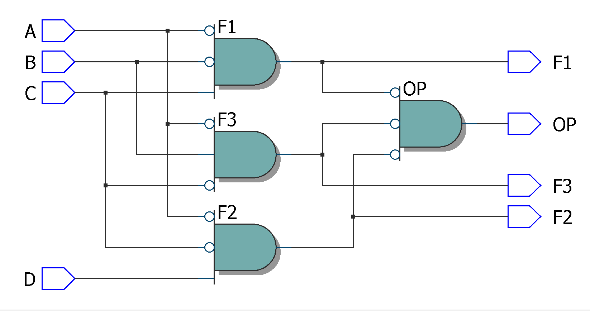
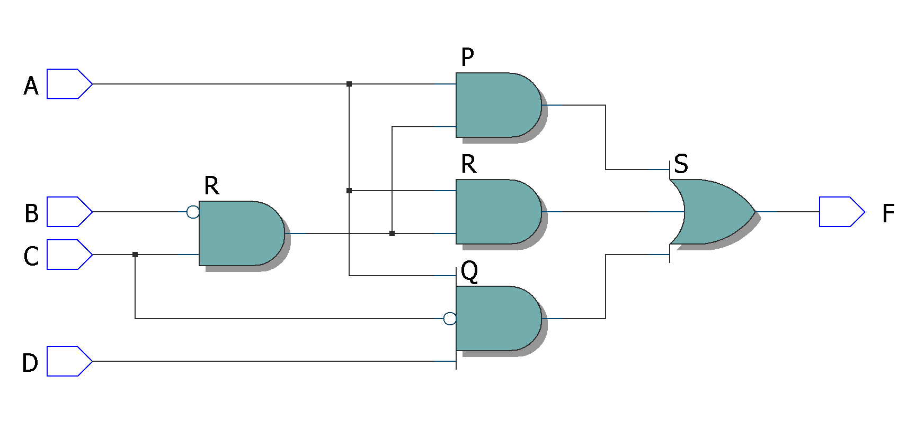

# Experiment--04-Implementation-of-combinational-logic-using-universal-gates-
 ## Implementation-of-Half-subtractor-and-Full-subtractor-circuit
## AIM:
To implement the given logic function using NAND and NOR gates and to verify its operation in Quartus using Verilog programming.
F=((C'.B.A)'(D'.C.A)'(C.B'.A)')' using NAND gate
F=(((C.B'.A)+(D.C'.A)+(C.B'.A))')' using NOR gate


## Equipments Required:
## Hardware – PCs, Cyclone II , USB flasher
## Software – Quartus prime
## Theory
 
 
 
 


## Procedure


Write the detailed procedure here 


## Program:
```
/*
Program to design a Implementation of combinational logic using universal gates-  and verify its truth table in quartus using Verilog programming.
Developed by: ANITHA.P
RegisterNumber:  212221240004
*/
```
```
(i)F=((C'.B.A)'(D'.C.A)'(C.B'.A)')' using NAND gate:
module gate1(A,B,C,D,F1,F2,F3,OP);
input A,B,C,D;
output F1,F2,F3,OP;
assign F1=C&~B&~A;
assign F2=D&~C&~A;
assign F3=~C&B&~A;
assign OP=(~F1&~F2&~F3);
endmodule
```
```
(ii)F=(((C.B'.A)+(D.C'.A)+(C.B'.A))')' using NOR gate:
module norcombo(A,B,C,D,F);
input A,B,C,D;
output F;
wire P,Q,R,S;
assign P=(C&~B&A);
assign Q=(D&~C&A);
assign R=(C&~B&A);
assign S=~(P|Q|R);
not(F,S);
endmodule
```
## Output:
## NAND gate:

## Truthtable


##  RTL realization:



## Timing diagram 
## NOR gate:

##  RTL realization:

## Result:
 
